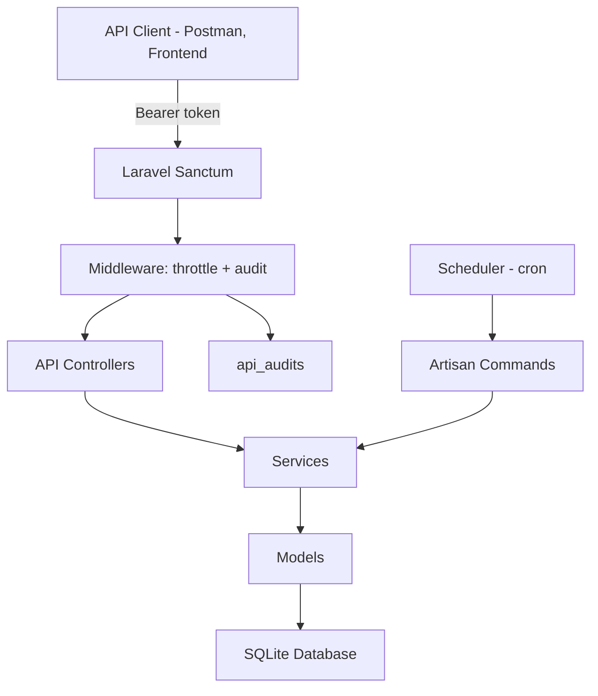

# 🚀 Support Ticket API Technical Test
A production ready Laravel API that simulates a high-volume support ticket system.

The project includes the following features:
- Laravel 12 backend using SQLite (as required by the test)
- Secured API using Laravel Sanctum token auth
- Scheduled commands for generating & processing support tickets
- Commands generate single tickets by default but can be scaled to generate multiple tickets at once with --count
- Rate-limited API (30 req/min per user/IP)
- Audit logging middleware (user, token, method, path, payloads, durations)
- Fully paginated API endpoints returning JSON Resources
- Postman collection for all endpoints
- Full unit & feature test suite with ~96% coverage

## ⚡ Quick Start
```bash
git clone https://github.com/awinwood/ticketapi ticketapi
cd ticketapi

cp .env.example .env
touch database/database.sqlite
composer install

php artisan key:generate
php artisan migrate
php artisan serve
```
Generate a token:
```bash
php artisan tinker
$user = \App\Models\User::first() ?? \App\Models\User::factory()->create();
$user->createToken('token', ['read:tickets'])->plainTextToken;
```
Use it with:
```bash
Authorization: Bearer <token>
```

## 📦 Tech Stack
Backend:
- Laravel 12
- PHP 8.3
- SQLite
- Sanctum (API token auth)

Dev Environment used:
- DDev + Docker
- WSL2 (Ubuntu)

## 🛠️ Installation and Setup (without DDev)

1. Clone the repo

```bash
git clone https://github.com/awinwood/ticketapi ticketapi
cd ticketapi
```

2. Create the SQLlite file

```bash
touch database/database.sqlite
chmod 775 database/database.sqlite
```

3. Environment Config

Copy the `.env` example
```bash
cp .env.example .env
```
Update the Session settings (to avoid SQLite db locks while testing)
```ini
SESSION_DRIVER=file
```
Setup the App Key
```bash
php artisan migrate
```

4. Install dependencies

```bash
composer install
php artisan vendor:publish --provider="Laravel\Sanctum\SanctumServiceProvider"
```

5. Migrate (creates the required tables in SQLite)

```bash
php artisan migrate
```

6. Run dev server
```bash
php artisan serve 
```

## 🔐 Authentication (Sanctum)
API endpoints are secured using **Bearer tokens** generated via Sanctum

Generate a token:
```bash
php artisan tinker

$user = \App\Models\User::first() ?? \App\Models\User::factory()->create();
$token = $user->createToken('test-token', ['read:tickets'])->plainTextToken;
```
Use it in Postman
```http
Authorization: Bearer <token>
```

## 📅 Scheduled Commands
The system includes two scheduled commands to simulate a support ticket system:

Generate a single dummy ticket, or multiple with --count 
```bash
php artisan tickets:generate
php artisan tickets:generate --count=50
```

Process (close) an open ticket, or multiple with --count
```bash
php artisan tickets:process
php artisan tickets:process --count=50
```

Run the scheduler to generate a new ticket every minute and process an open ticket every 5 minutes
```bash
php artisan schedule:run
```

## 📡 API Endpoints
All responses are structured JSON using Laravel API Resources.

### GET /api/tickets/open
- Returns paginated list of open tickets using query params:
    - page=1 (default)
    - per_page=50 (default)
- Sorted by oldest first

### GET /api/tickets/closed
- Returns paginated list of closed tickets using query params:
    - page=1 (default)
    - per_page=50 (default)
- Sorted by most recently closed

### GET /api/users/{userId}/tickets
- Tickets belonging to a specific user

### GET /api/stats
Returns:
```json
{
    "total_tickets": 1234567,
    "total_unprocessed_tickets": 34000,
    "top_user": {
       "name": "Jane Doe",
       "email": "jane@example.com",
       "tickets_count": 1400
    },
    "most_recent_processed_at": "2025-01-01 12:30:00"
}
```

## 🧩 Architecture Overview




## 🧵 Rate Limiting
All API endpoints are rate limited to 30 requests per minute per user/IP.

Laravel responds with a 429 Too Many Requests status code if the limit is exceeded.

## 🕵️ Audit Logging
Every API request goes through a custom middleware that logs to the `api_audits` table:
- Authenticated user and access token
- HTTP method
- Route name
- URI
- Status code
- IP address
- User agent
- Duration
- Query/body payloads


## 🧪 Tests
Test suite uses Pest + PHPUnit and includes:
- Model tests & resource tests
- Enum tests
- API endpoint tests
- Command tests (generator + processor)
- Middleware/audit logging tests
- current coverage: 95.7% (exceeds 80% required coverage)

Run tests with coverage (requires Xdebug):
```bash
php artisan test --coverage
```

## 📁 Postman Collection
A complete Postman collection is included at `postman/TicketApi.postman_collection.json`

It includes:
- All endpoints
- Example requests & example responses
- Environment variable for URL {{baseUrl}} 
- Pre-set Authorization: Bearer {{apiToken}} header

## 📝 Notes

- Designed to scale to 1M+ ticket rows via pagination, indexing, and lightweight queries
- SQLite is used only because the technical test requires it
- In production this would use MySQL + Horizon + queues
